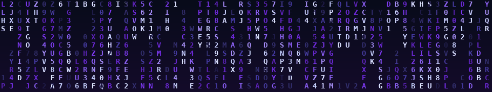

 

 

---

## About me

- 🚀 I'm currently building **Automation Program**
- 🧠 Learning **Server**
- 🎮 When not coding, you'll find me **Gaming**
- ⚡ Fun fact: **I'm is me!**

## Stats

## Find me elsewhere

⚡ Thanks for stopping by

